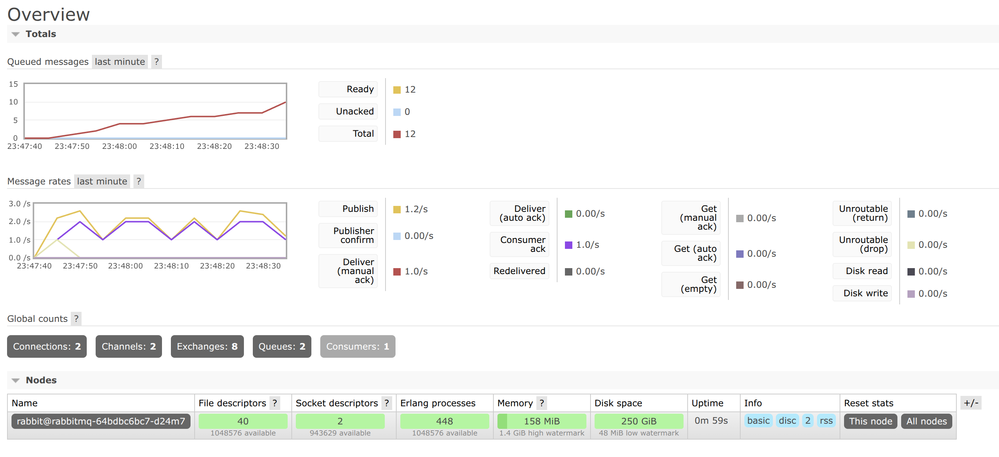

# Домашняя работа по RabbitMQ

## 1. Сборка docker контейнеров
```bash
docker build -t producer:latest ./producer
docker build -t consumer:latest ./consumer
docker build -t rabbitmq:latest ./rabbitmq
```

## 2. Запуск Minikube
```bash
minikube start --driver=docker
```

## 3. Загрузка docker-images в Minikube
```bash
minikube image load rabbitmq:latest
minikube image load producer:latest
minikube image load consumer:latest
```

## 4. Деплой файлов в kubernetes
```bash
kubectl apply -f rabbitmq/deployment.yaml
kubectl apply -f rabbitmq/service.yaml

kubectl apply -f producer/deployment.yaml
kubectl apply -f consumer/deployment.yaml
```

## 5. Проверка ресурсов
```bash
kubectl get pods
kubectl get svc
```

## 6. Тест
```bash
kubectl port-forward deployment/rabbitmq 15672:15672
```

