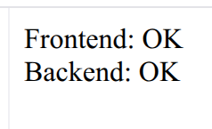

# Домашняя работа по kubernetes

## 1. Сборка docker контейнеров
```bash
docker build -t backend:latest ./backend
docker build -t frontend:latest ./frontend
```

## 2. Запуск Minikube
```bash
minikube start --driver=docker
```

## 3. Загрузка docker-images в Minikube
```bash
minikube image load backend:latest
minikube image load frontend:latest
```

## 4. Деплой файлов в kubernetes
```bash
kubectl apply -f backend/deployment.yaml
kubectl apply -f backend/service.yaml
kubectl apply -f frontend/deployment.yaml
kubectl apply -f frontend/service.yaml
```

## 5. Проверка ресурсов
```bash
kubectl get pods
kubectl get svc
```

## 6. Тест
```bash
minikube service frontend
```

## Результат


